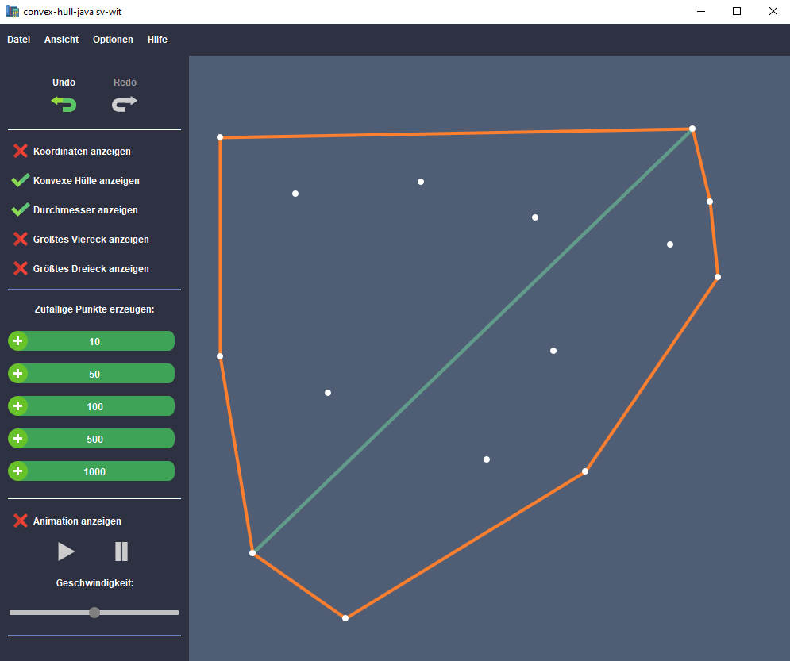

# Convex Hull Java

This project computes the convex hull of a given or newly created set of points.  
You can import a file with points or add new points by clicking in the GUI.  

**Note:** This project was developed as part of a university assignment and is my first larger project.  
If you decide to review or critique the code, please do so constructively! 😄

---

## Features

- Computes the convex hull for 2D point sets
- Calculates the diameter (the largest distance within the hull)
- Finds the largest quadrilateral contained inside the hull
- Finds the largest triangle contained inside the hull
- Interactive GUI to add points and visualize results
- Undo and Redo functionality for point editing

---

## Java Version

Tested with **JDK 17.0.2**

---

## How to Run

1. Clone the repository:  
   `git clone https://github.com/sv-wit/convex-hull-java.git`

2. Import the project into your IDE (e.g., Eclipse)

3. Run the main class `convex_hull_main`

---

## Language Information

**⚠️ NOTE:**  
Due to university requirements, both the GUI and the documentation are in German.  

The JavaDoc documentation can be found in the `doc` folder.  
Please keep this in mind when using the application.

---

## Data Format

The program accepts point data files in the following format:

- Each point is represented on a separate line.
- Each line contains two numbers: the X and Y coordinates, separated by a space or a comma.
- By default, files use the `.points` extension.

Example:
```
10 15
20 25
30 35
```

---

## Screenshots

  
*Figure 1: Main GUI of the application*

---

## About

This project was developed as part of a university assignment.

---

## Author

sv-wit
